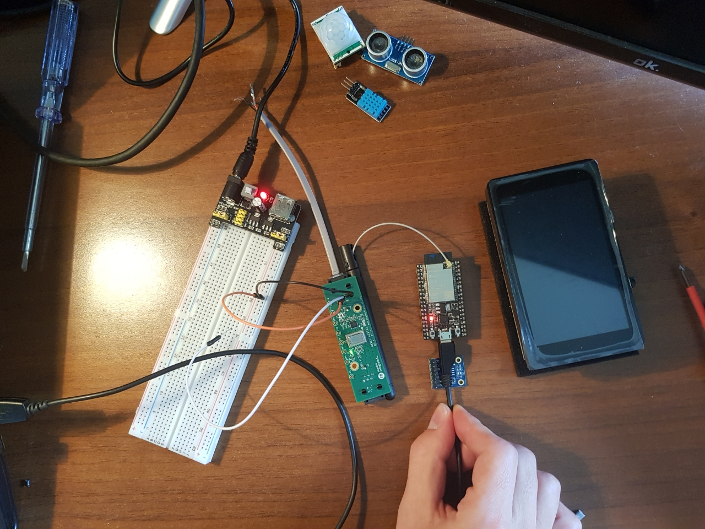
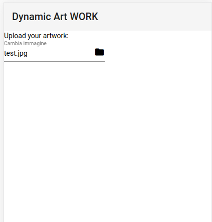

# Second Delivery

## Comments
- Startup style: no good
- Can you project IoT data to the museum artworks?
- Make clear the IoT role.
- Clarify whether users need it. Are they distracted from the original message of the artifact?
- Focus on one focusing a MVP approach

## Changes
- Architecture: 
For the architecture, the changes concern the suite of google cloud, in fact now, we use Google Cloud Vision to manage the images stored inside bucket of Google Cloud Storage. The images can be managed within the suite of google with Google Cloud Pub/Sub and then using Google IoT Core we can get the images to the device that is subscripted to a certain topic.

- Evaluation plan:
For the evaluation we evaluated all the opinions collected by the artists interviewed that suggest us to add sensors that allow visitors to be the proponents of the dynamism of the work of art. In addition, after receiving the STM32MP157C Board with an eye-grid sensor, testing can be done locally using real data thus eliminating the component of Iot lab.

## Technical work done since the 1st delivery
- We ordered the board and sensor we needed.
- We started creating the webapp.
- We have configured Google Cloud Platform and its components including Google Iot Core with which to manage the data coming from the board and Google AI with which to perform the modeling.
- **For Testing**: for testing we used this [tutorial](https://cloud.google.com/run/docs/tutorials/pubsub?authuser=1) which allowed us to set Google Pub/Sub and this [tutorial](https://cloud.google.com/run/docs/tutorials/image-processing?authuser=1) for processing images from Cloud Storage tutorial. We also flashed an ESP board with RIOT-OS and with the help of a transparent bridge and mosquitto-rsmb to communicate the board with Google Iot Core.

## Functionality still missing
- firebase configuration to accommodate all data from the device.
- Grid eye sensors
- Use of Machine Learning 

# Live demo
- [YouTube video](https://youtu.be/IuAJRV1asrU)
- [Web app](https://dynartwork-277815.web.app/)

**Functionalities**:
1. RIOT-OS on ESP32 with WiFi connection.
2. ESP32 MQTT-SN -> Transparent Bridge -> Google IoT Core
3. Upload image from PWA to Google Storage.
4. Process images async using Cloud Run and Cloud Vision API
5. Fetch processed image with Python on STM32MPU board.

## Next evaluation

The model to be used will be [arbitrary_image_stylization](https://github.com/tensorflow/magenta/tree/master/magenta/models/arbitrary_image_stylization).
A very important part to assess will be the costs. Google AI allows us to run the model for Neural Style Transfer with Tensorflow using google machines with a cost of between € 90 and € 120 per month and an hourly rate of € 0.20. Therefore we will also have to evaluate the possibility of edge computing and then to run the model directly on the Board